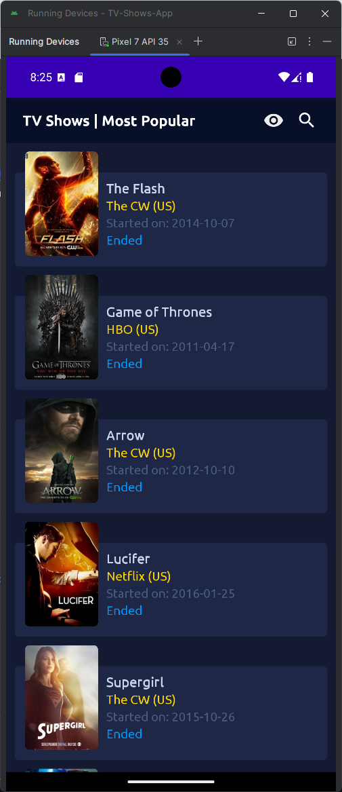
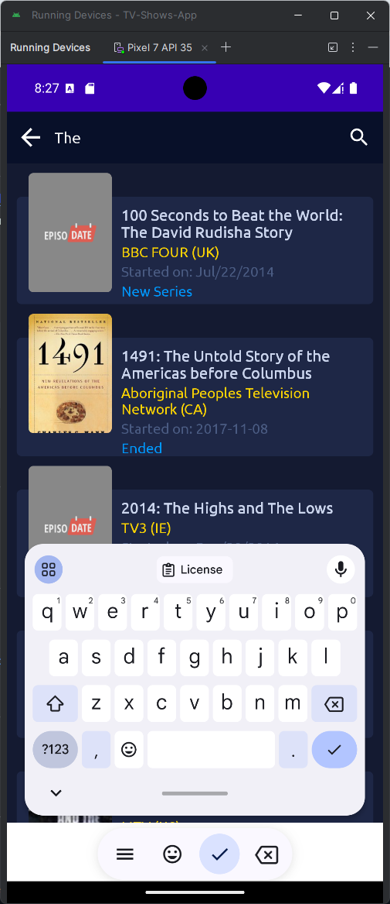
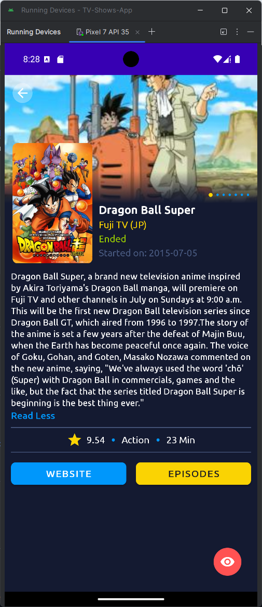

# TV Shows App

TV Shows App is an Android application developed using **MVVM architecture**. This app allows users to browse and search for TV shows from the [Episodate](https://www.episodate.com/api) API.

## Table of Contents
- [Features](#features)
- [Technologies Used](#technologies-used)
- [Installation and Running the App](#installation-and-running-the-app)
- [Screenshots](#screenshots)
- [Notes](#notes)

## Features
- Display a list of popular TV shows.
- Search for TV shows by name.
- View detailed information for each show, including title, air date, rating, number of episodes, etc.
- Store data offline using the **Room** database.

## Technologies Used
- **MVVM Architecture**: Separation of logic and UI.
- **Retrofit**: HTTP API call library.
- **Lifecycle Extensions**: Android lifecycle management.
- **Room**: Local data storage.
- **RxJava**: Asynchronous processing.
- **Material Design**: Modern UI design.
- **Data Binding**: Bind data directly to UI elements.

## Installation and Running the App

1. Clone this repository:

   ```bash
   git clone https://github.com/NguyenDacCuong2604/TV-Shows-App
2. Open the project in Android Studio.

3. Build and run the app on an emulator or a physical device.

## Screenshots

TV Show List | Search | Show Details
------------------------- | -------- | -------------------
 |  | 

## Notes

- Data is fetched from the [Episodate API](https://www.episodate.com/api).
- The app uses **Room** to store data offline. 
- Based on the tutorial series [**Android MVVM | TV Shows App Development | Android Studio**](https://youtube.com/playlist?list=PLam6bY5NszYOUDKwe-6tVhb3zVevwbHiK&si=n6t5C6O0adjkEndp) 
- Contributions and feedback are welcome! Feel free to create an issue or pull request if you want to improve this project.
